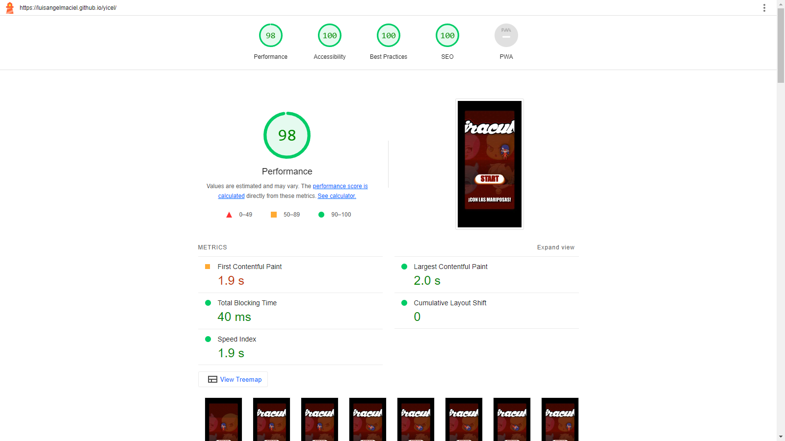

# Miraculous Ladybug - Juego de computadora Online 

## Platforms
Play in browser Windows 
<a href="https://luisangelmaciel.itch.io/miraculous-ladybug">Available in itch.io</a> 

## Contribute
Want to be part of the Yicel Game project? Great! All are welcome! We will get there quicker together :) Whether you find a bug, have a great feature request, or you fancy owning a task from the road map above, feel free to get in touch.

## Current features
Full scene graph
Base64 Fontfamily
Base64 vector img
Primitive Drawing
Masking
Filters

## Demo
<a href="https://luisangelmaciel.github.io/yicel/" target="_blank"> Miraculous Ladybug - Juego de computadora Online </a>

## Previews

<!-- Terminar https://github.com/luisangelmaciel/flathub https://docs.flathub.org/docs/for-app-authors/submission/  -->

## Resultado de la prueba de rendimiento de la página web  por <a href="https://www.webpagetest.org/">webpagetest.org</a>

### ¿Es rápido?
Nada mal... Este sitio se conectó rápidamente y entregó el código inicial. Comenzó a reproducir contenido muy rápidamente. No hubo solicitudes de bloqueo de renderizado. El contenido más grande renderizado rápidamente.

### ¿Es utilizable?
Nada mal... Este sitio tuvo cambios importantes en el diseño. Tomó poco tiempo volverse interactivo. Tenía 1 problema de accesibilidad, ninguno grave. El contenido HTML se generó principalmente en el lado del servidor.

### ¿Es resistente?
¡Se ve muy bien! Este sitio no tenía solicitudes de terceros que bloquearan el procesamiento y que pudieran ser un único punto de falla. No tuvo problemas de seguridad. El contenido HTML se generó principalmente en el lado del servidor.

### Lighthouse

